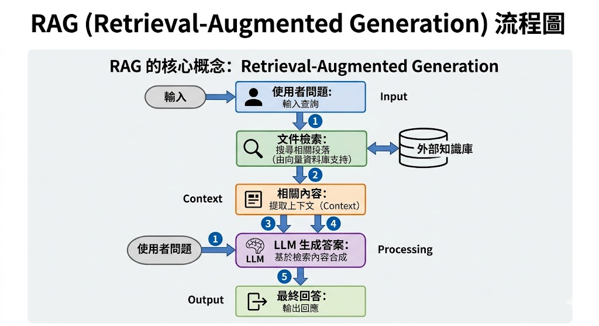
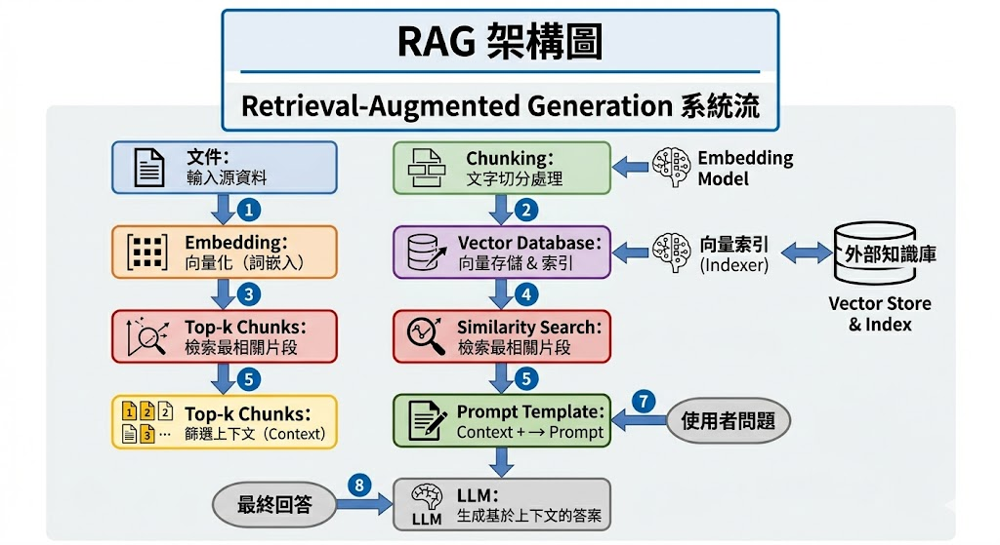
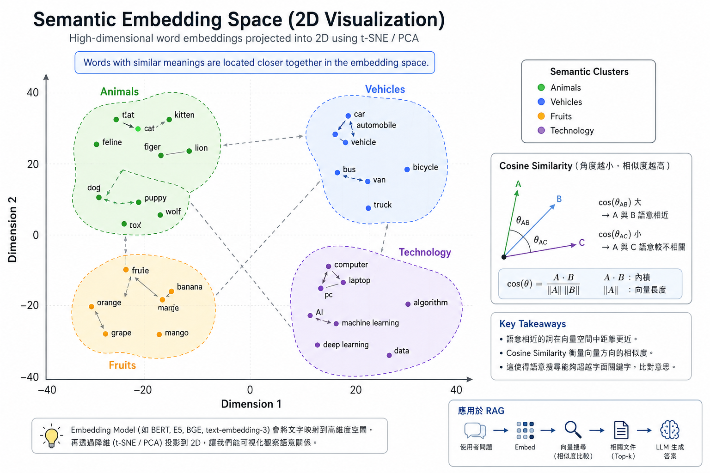
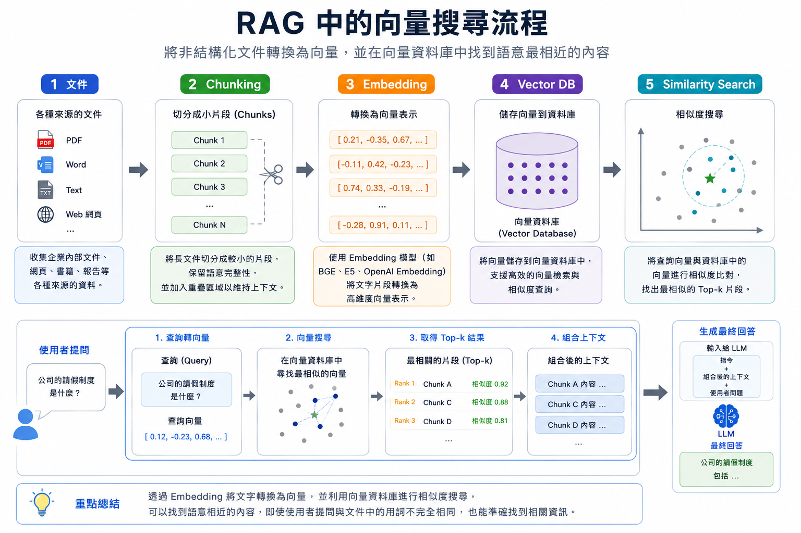
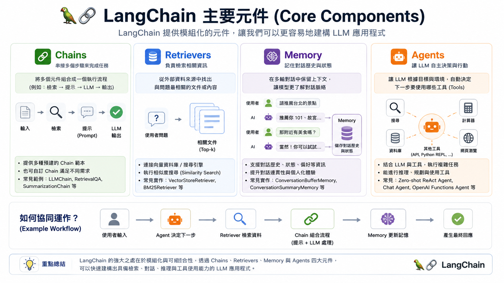

# Retrieval-Augmented Generation (RAG)

## 從理論到 From-Scratch 實作

---

<!-- _class: agenda -->

# 課程主題

1. 為什麼需要 RAG？
2. Embedding
3. Cosine Similarity
4. Vector Database
5. RAG Pipeline
6. From Scratch RAG
7. LangChain
8. Advanced RAG
9. Local LLM + RAG
10. Agentic RAG

---

# 為什麼傳統 LLM 不夠？

主要問題：

- Hallucination（幻覺）
- 知識過期
- 無法存取私有文件
- Context Window 有限制
- Fine-tuning 成本高

---

# 問題範例

## 問題

「我們公司的請假制度是什麼？」

## 傳統 LLM

「我不知道你公司的內部文件內容。」

---

<!-- _class: flow -->

# RAG 的核心概念



---

<!-- _class: flow -->

# RAG 架構圖



---

# RAG vs Fine-tuning

| 方法 | 用途 |
|---|---|
| Fine-tuning | 改變模型能力 |
| RAG | 增加外部知識 |

---

# 什麼是 Embedding？

文字 → 向量

```python
"I love AI"

↓

[0.23, -0.51, 0.88, ...]
```

---

# Embedding 空間中的語意

### Semantic Meaning in Embedding Space

當文字經過 Embedding Model 後，
模型會將語意相近的詞語，
映射到「向量空間中彼此接近的位置」。

也就是說：

語意越接近 → 向量方向越相似 → 向量距離越近

---

<!-- _class: embedding-sim -->

# Embedding 空間中的語意



---

# 高維度向量空間

Embedding 模型會將文字轉換成：

- 384 維
- 768 維
- 1536 維
- 或更高維度

目標：

讓語意相似度能被計算。

---

# 我們如何比較 Embedding？

問題：

如何判斷兩個向量是否相似？

常見方法：

- Euclidean Distance
- Manhattan Distance
- Dot Product
- Cosine Similarity

---

# Euclidean Distance

直線距離。

```text
A = [1, 1]
B = [100, 100]
```

問題：

- 方向相同
- magnitude 差很多
- 距離會變得非常大

---

# 為什麼 Euclidean Distance 不適合 NLP？

在 NLP 中：

- 文字長度不同
- embedding 大小不同
- token 數量不同

但：

語意可能仍然非常接近。

---

<!-- _class: cosine-summary -->

# Cosine Similarity 的核心思想

<div class="columns">
<div>

我們真正關心的是**向量方向**，而不是大小。

<div class="formula">

$$
\cos(\theta)=\frac{A \cdot B}{||A|| ||B||}
$$

</div>

- A · B = 內積
- ||A|| = 向量長度

</div>
<div>

## 幾何上的意義

| 角度 | Similarity |
|---|---|
| 0° | 1 |
| 90° | 0 |
| 180° | -1 |

</div>
</div>

---

# 為什麼方向比較重要？

即使向量長度不同：

```text
[1, 1]
[100, 100]
```

Cosine Similarity 仍然會認為：

- 方向一致
- 語意接近

---

# Cosine Similarity 在 NLP 的優勢

優點：

1. 不受 magnitude 影響
2. 適合高維度空間
3. 強調語意方向
4. 適合 Transformer embedding
5. 適合向量搜尋

---

# Cosine Similarity 在 RAG 的用途

用來比較：

```text
問題向量
      vs
文件向量
```

目的：

找到最相關的文件 chunk。

---

# 常見 Embedding Model

| Model | 特點 |
|---|---|
| text-embedding-3-small | OpenAI |
| BGE | 中文效果強 |
| E5 | 熱門開源模型 |
| Instructor | instruction-aware |

---

# 什麼是 Vector Database？

用來高效率儲存 embedding。

常見選擇：

- FAISS
- Chroma
- Milvus
- Pinecone
- Weaviate

---

# 為什麼需要 Vector Database？

傳統資料庫：

- 精確比對

Vector Database：

- 語意搜尋

---

<!-- _class: full-image compact -->

# 向量搜尋流程



---

<!-- _class: chunking-summary -->

# Chunking

<div class="columns">
<div>

Chunking 是把大型文件切成多個有語意的小片段，讓檢索時可以找到「最相關的段落」，而不是把整份文件都丟給 LLM。

常見做法：

- 依段落、標題或固定字數切分
- 保留少量 overlap，避免上下文斷裂
- 每個 chunk 再轉成 embedding 存進向量資料庫

效果：

- 避免超過 LLM token 限制
- 提高搜尋精準度
- 減少無關內容干擾回答

</div>
<div>

## 範例

```text
原始文件：
本校學生請假須於事前完成線上申請。
病假需於返校後三日內補交證明。
若連續請假超過三日，須通知導師與系辦。

Chunk 1：
本校學生請假須於事前完成線上申請。

Chunk 2：
病假需於返校後三日內補交證明。

Chunk 3：
若連續請假超過三日，須通知導師與系辦。
```

</div>
</div>

---

<!-- _class: chunk-size-summary -->

# Chunk Size 的問題

<div class="columns">
<div>

Chunk size 決定每個片段包含多少上下文。

太小：

- 上下文遺失
- 檢索結果可能只找到片段句子

太大：

- 搜尋結果容易混亂
- 夾帶太多不相關內容

Overlap 是讓相鄰 chunk 重疊一小段文字，避免重要資訊剛好被切斷。

</div>
<div>

## 實際範例

```text
原始文本：
學生請假須先完成線上申請，並由導師審核。
病假可於返校後三日內補交醫療證明。
若連續請假超過三日，系辦會通知家長。

太小：
Chunk 1：學生請假須先完成線上申請
Chunk 2：並由導師審核

問題：查「請假流程」時，審核資訊可能分散。

加入 overlap：
Chunk 1：學生請假須先完成線上申請，並由導師審核。
Chunk 2：並由導師審核。病假可於返校後三日內補交醫療證明。

效果：保留上下文連續性。
```

</div>
</div>

---

<!-- _class: recursive-chunking -->

# Recursive Chunking

<div class="columns">
<div>

Recursive Chunking 會按照「由大到小」的分隔符嘗試切割：

段落 → 換行 → 句子 → 空白 → 字元

如果切出來的片段還是太長，就繼續往下一層規則切；如果長度合適，就保留下來。

常見工具：

`RecursiveCharacterTextSplitter`

優點：

- 切割更自然
- 保留句子結構
- 不容易把重要語意切斷
- 比固定長度切割更適合文件型資料

</div>
<div>

## 實際範例

```text
原始文件：
# 請假規定
學生請假須先完成線上申請，並由導師審核。
病假可於返校後三日內補交醫療證明。

# 缺席通知
若連續請假超過三日，系辦會通知家長。

切分優先順序：
先用「標題 / 空行」切
再用「句號」切

Chunk 1：
# 請假規定
學生請假須先完成線上申請，並由導師審核。

Chunk 2：
病假可於返校後三日內補交醫療證明。

Chunk 3：
# 缺席通知
若連續請假超過三日，系辦會通知家長。
```

</div>
</div>

---

# From Scratch RAG

今天我們將建立：

- 文件讀取器
- Chunk 系統
- Embedding 系統
- 向量搜尋
- Prompt Injection
- LLM 回答生成

---

<!-- _class: rag-build install -->

# 安裝與實作目標

<div class="columns">
<div>

接下來會用最小版本建立 RAG：

- 讀取文件
- 切成 chunks
- 產生 embeddings
- 建立向量索引
- 搜尋相關 chunks
- 組成 prompt

</div>
<div>

```bash
pip install sentence-transformers faiss-cpu transformers
```

```text
data.txt → chunks → embeddings
        → vector search → prompt
```

</div>
</div>

---

<!-- _class: rag-build reading -->

# 讀取文件與 Chunking

<div class="columns">
<div>

先把原始文件讀成字串，再切成適合檢索的小片段。實務上可用 recursive chunking；這裡先用空行示範最小流程。

</div>
<div>

```python
with open("data.txt", encoding="utf-8") as f:
    text = f.read()

chunks = [
    chunk.strip()
    for chunk in text.split("\n\n")
    if chunk.strip()
]
```

</div>
</div>

---

<!-- _class: rag-build embedding -->

# Embedding 與 FAISS Index

<div class="columns">
<div>

每個 chunk 會被轉成向量，FAISS 負責儲存與快速搜尋。查詢時，問題也要先轉成同一個 embedding 空間中的向量。

</div>
<div>

```python
from sentence_transformers import SentenceTransformer
import faiss

model = SentenceTransformer("BAAI/bge-small-en")

embeddings = model.encode(chunks)
dimension = embeddings.shape[1]

index = faiss.IndexFlatL2(dimension)
index.add(embeddings)
```

</div>
</div>

---

<!-- _class: rag-build -->

# Similarity Search 到 Prompt Injection

<div class="columns">
<div>

RAG 的關鍵是把搜尋到的相關內容注入 prompt，讓 LLM 根據外部文件回答，而不是只依賴模型記憶。

</div>
<div>

```python
query = "What is RAG?"
query_embedding = model.encode([query])

D, I = index.search(query_embedding, k=3)

retrieved_docs = [chunks[i] for i in I[0]]

prompt = f"""
Context:
{retrieved_docs}

Question:
{query}
"""
```

</div>
</div>

---

# 接上 LLM

可以使用：

- OpenAI API
- Ollama
- HuggingFace Transformers

---

# 完整 RAG Pipeline

```text
PDF
 ↓
Chunking
 ↓
Embedding
 ↓
Vector Search
 ↓
Prompt
 ↓
LLM
```

---

# 為什麼需要 Framework？

純手刻的問題：

- 程式碼很多
- Pipeline 複雜
- 整合困難

---

<!-- _class: full-image -->

# LangChain



---

<!-- _class: langchain-example -->

# LangChain 範例：建立 Retriever

<div class="columns">
<div>

先準備幾段文件，建立 embedding 與 FAISS vector store，再把它轉成 retriever。

查詢問題：

`病假證明多久內要補交？`

</div>
<div>

```python
from langchain_community.vectorstores import FAISS
from langchain_huggingface import HuggingFaceEmbeddings
from langchain_core.documents import Document

docs = [
    Document(page_content="學生請假須先完成線上申請。"),
    Document(page_content="病假可於返校後三日內補交醫療證明。"),
    Document(page_content="連續請假超過三日須通知導師與系辦。"),
]

embeddings = HuggingFaceEmbeddings(
    model_name="BAAI/bge-small-en"
)

db = FAISS.from_documents(docs, embeddings)
retriever = db.as_retriever(search_kwargs={"k": 2})

query = "病假證明多久內要補交？"
retrieved_docs = retriever.invoke(query)
```

</div>
</div>

---

<!-- _class: langchain-example -->

# Retriever 結果轉成 Prompt

<div class="columns">
<div>

Retriever 會回傳相關 documents。RAG 要做的是把這些內容整理成 context，再和使用者問題一起放進 prompt。

預期輸出：

```text
病假證明須於返校後三日內補交。
```

</div>
<div>

```python
context = "\n".join(
    doc.page_content for doc in retrieved_docs
)

prompt = f"""
請只根據 Context 回答問題。

Context:
{context}

Question:
{query}

Answer:
"""

print(context)
```

```text
病假可於返校後三日內補交醫療證明。
學生請假須先完成線上申請。
```

</div>
</div>

---

# Advanced RAG

進階主題：

- Hybrid Search
- Re-ranking
- Query Rewrite
- Multi-query RAG
- Context Compression

---

<!-- _class: advanced-detail -->

# Hybrid Search

<div class="columns">
<div>

Hybrid Search 會同時使用關鍵字搜尋與向量搜尋。

適合情境：

- BM25 關鍵字搜尋
- Vector Search
- 文件裡有專有名詞、法規條號、產品型號
- 問題也需要語意相似度

做法：先各自取回候選文件，再合併分數或取聯集。

</div>
<div>

```python
query = "病假補交證明期限"

bm25_hits = keyword_search(query, k=10)
vector_hits = vector_search(query, k=10)

merged = merge_results(
    bm25_hits,
    vector_hits,
    weights={"bm25": 0.4, "vector": 0.6}
)
```

```text
BM25 找到：病假、證明、期限
Vector 找到：返校後三日內補交醫療證明
```

</div>
</div>

---

<!-- _class: advanced-detail -->

# Re-ranking

<div class="columns">
<div>

向量搜尋通常先求「大致相關」，但 Top-k 裡仍可能混入不精準的 chunk。

Re-ranking 會用更精細的模型重新判斷：

- query 與 chunk 是否真的回答同一個問題
- 重新排序 Top 20
- 最後只送 Top 3 給 LLM

</div>
<div>

```text
Query:
病假證明多久內要補交？

Top 20 retrieved chunks
  ↓
Cross Encoder / Reranker
  ↓
Top 3:
1. 病假可於返校後三日內補交醫療證明。
2. 請假須完成線上申請。
3. 連續請假超過三日須通知導師。
```

```python
pairs = [(query, doc) for doc in retrieved_docs]
scores = reranker.predict(pairs)
top_docs = sort_by_score(retrieved_docs, scores)[:3]
```

</div>
</div>

---

<!-- _class: advanced-detail -->

# Multi-query RAG

<div class="columns">
<div>

Multi-query RAG 會請 LLM 把同一個問題改寫成多個查詢角度，再分別檢索。

好處：

- 降低單一 query 沒搜到的風險
- 捕捉同義詞與不同問法
- 適合使用者問題很短或很模糊時

</div>
<div>

```text
原始問題：
學生請病假要準備什麼？

改寫 queries：
1. 病假需要提交哪些證明？
2. 學生請假規定中的病假流程是什麼？
3. 醫療證明補交期限是多久？
```

```python
queries = llm.generate_queries(user_question, n=3)
docs = []

for q in queries:
    docs.extend(retriever.search(q, k=3))

retrieved_docs = deduplicate(docs)
```

</div>
</div>

---

<!-- _class: advanced-detail -->

# Context Compression

<div class="columns">
<div>

Context Compression 會把 retrieved chunks 中真正有用的句子留下來，刪掉無關內容。

目的：

減少不必要內容。

優點：

- 降低 token 使用量
- 提高回答品質
- 減少 LLM 被雜訊誤導

</div>
<div>

```text
原始 chunk：
學生請假須先完成線上申請，並由導師審核。
病假可於返校後三日內補交醫療證明。
校外活動請假須另附家長同意書。

問題：
病假證明多久內要補交？

壓縮後 context：
病假可於返校後三日內補交醫療證明。
```

```python
compressed = compressor.compress(
    query=query,
    documents=retrieved_docs
)
```

</div>
</div>

---

<!-- _class: advanced-detail -->

# RAG Evaluation

<div class="columns">
<div>

RAG 不只評估「答案看起來對不對」，還要分開檢查檢索與生成。

- Recall
- Faithfulness
- Groundedness
- Relevance

常見問題：

- 有沒有找回正確 chunk？
- 答案是否忠於 context？
- 有沒有編造 context 沒有的資訊？

</div>
<div>

```text
Question:
病假證明多久內要補交？

Gold context:
病假可於返校後三日內補交醫療證明。

Answer:
病假證明須於返校後三日內補交。
```

```python
eval_item = {
    "question": query,
    "contexts": retrieved_docs,
    "answer": answer,
    "ground_truth": "返校後三日內"
}
```

</div>
</div>

---

# Local LLM + RAG

優點：

- 隱私性高
- 成本低
- 可離線使用

---

<!-- _class: ollama-models -->

# Ollama

<div class="columns">
<div>

## LLM 模型

本地模型適合隱私資料與離線環境：

```bash
ollama run llama3
```

Ollama Cloud 可在沒有強 GPU 時執行較大的模型：

```bash
ollama signin
ollama run gpt-oss:120b-cloud
```

</div>
<div>

## 建議模型

<div class="model-grid">
<div class="model-card">
<strong>gpt-oss:120b-cloud</strong>
<span>強推理、官方文件示範</span>
</div>
<div class="model-card">
<strong>qwen3.5</strong>
<span>多語、工具使用</span>
</div>
<div class="model-card">
<strong>gemma4</strong>
<span>通用、推理、多模態</span>
</div>
<div class="model-card">
<strong>nomic-embed-text</strong>
<span>Ollama local embedding</span>
</div>
</div>
</div>
</div>

---

<!-- _class: embedding-options -->

# Embedding 寫法比較

<div class="columns">
<div>

## HuggingFace / SentenceTransformer

適合直接使用開源 embedding model。

```python
from sentence_transformers import SentenceTransformer

embed_model = SentenceTransformer("BAAI/bge-m3")
vectors = embed_model.encode(chunks)
```

</div>
<div>

## Ollama Embedding

適合統一用 Ollama 管理本地模型。

```python
import ollama

vectors = [
    ollama.embeddings(
        model="nomic-embed-text",
        prompt=chunk
    )["embedding"]
    for chunk in chunks
]
```

</div>
</div>

---

<!-- _class: agentic-tools -->

# Agentic RAG

<div class="columns">
<div>

Agentic RAG 讓 agent 不只是「查一次資料後回答」，而是可以規劃、選工具、多次檢索、再整合答案。

- 搜尋文件
- 使用工具
- 規劃任務
- 多步推理

</div>
<div>

## 熱門工具

<div class="tool-grid">
<div class="tool-card">
<strong>LangGraph</strong>
<span>狀態式 agent workflow</span>
</div>
<div class="tool-card">
<strong>LlamaIndex</strong>
<span>RAG-first agents</span>
</div>
<div class="tool-card">
<strong>CrewAI</strong>
<span>多 agent 協作</span>
</div>
<div class="tool-card">
<strong>OpenAI Agents SDK</strong>
<span>工具呼叫與 handoff</span>
</div>
<div class="tool-card">
<strong>Microsoft Agent Framework</strong>
<span>企業 workflow / memory</span>
</div>
<div class="tool-card">
<strong>Pydantic AI</strong>
<span>型別安全 Python agents</span>
</div>
</div>

</div>
</div>

---

<!-- _class: mcp-rag -->

# MCP + RAG

<div class="columns">
<div>

MCP（Model Context Protocol）可以把外部資料源與工具包成標準介面，讓 Agent 或 RAG 系統用一致的方式存取。

RAG 原本擅長「從知識庫找資料」；MCP 則讓系統可以連到更多即時或私有資源。

</div>
<div>

## 可連接的資源

- File System
- Database
- API
- Knowledge Server
- Google Drive / Notion / Slack
- 企業內部文件與服務

</div>
</div>

---

<!-- _class: mcp-rag -->

# MCP + RAG 流程範例

<div class="columns">
<div>

使用者問問題時，Agent 可以先判斷資料在哪裡，再透過 MCP 工具取得資料，最後交給 RAG 檢索與生成。

適合場景：

- 企業知識庫問答
- 專案文件查詢
- 即時資料查詢
- 多系統資料整合

</div>
<div>

```text
User Question
   ↓
Agent 判斷需要哪個資料源
   ↓
MCP Tool 讀取 File / DB / API
   ↓
Chunk + Embedding
   ↓
Retriever 找相關內容
   ↓
LLM 根據 context 回答
```

```python
docs = mcp_client.call_tool(
    "read_project_docs",
    {"folder": "RAG_tutorial"}
)

answer = rag_pipeline.ask(
    question=user_question,
    documents=docs
)
```

</div>
</div>

---

# 未來方向

- GraphRAG
- Multimodal RAG
- Long-context RAG
- Memory System
- Autonomous Agents

---

# 建議作業

1. 建立 PDF QA 系統
2. 比較不同 chunk size
3. 比較 embedding model
4. 建立中文 RAG 系統

---

# 推薦資源

- LangChain: https://docs.langchain.com/
- LlamaIndex: https://docs.llamaindex.ai/
- FAISS: https://faiss.ai/
- Sentence Transformers: https://sbert.net/
- Ollama: https://docs.ollama.com/
